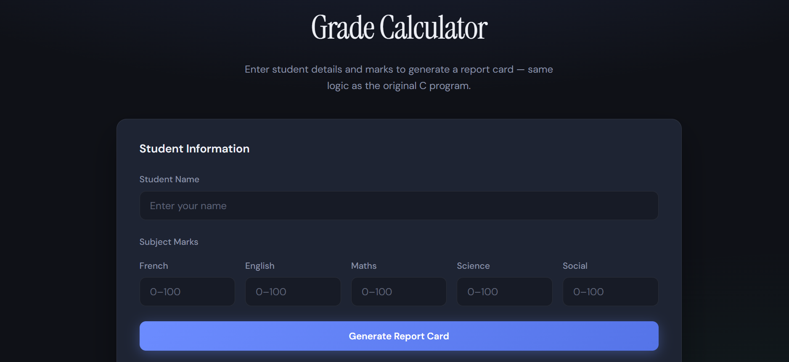
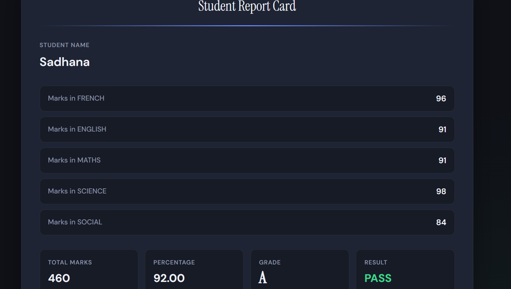

# Student Grade Calculator

A Student Grade Calculator built using C programming and converted into a modern web application using HTML, CSS, and JavaScript.

## Live Demo

https://sadhanapragash.github.io/STUDENT_GRADE_CALCULATOR/

## Features

* Enter student details
* Calculate total marks
* Calculate percentage
* Generate grades automatically
* Display pass/fail result
* Responsive web interface

## Screenshots

## Technologies Used

* C
* HTML
* CSS
* JavaScript

## Author

Sadhana Pragash

